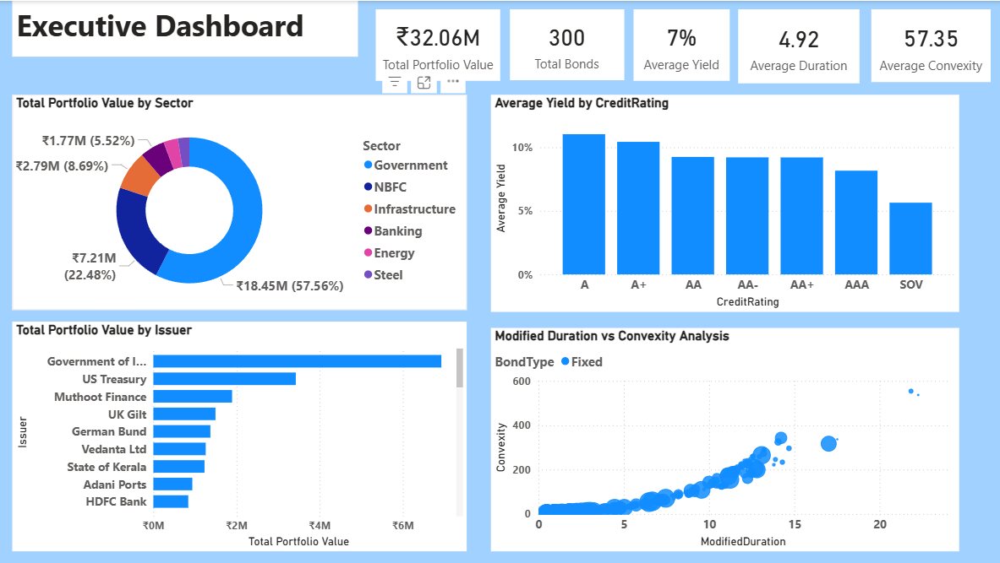
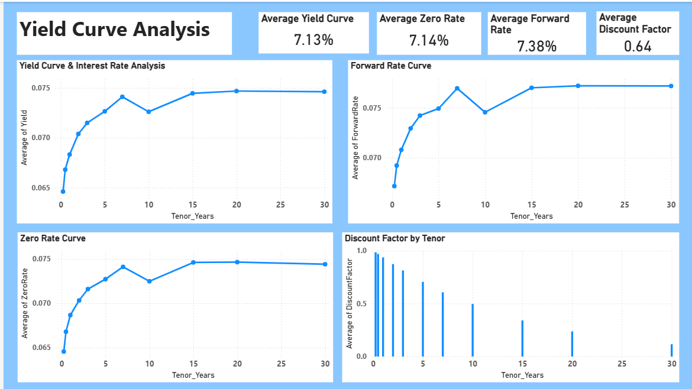
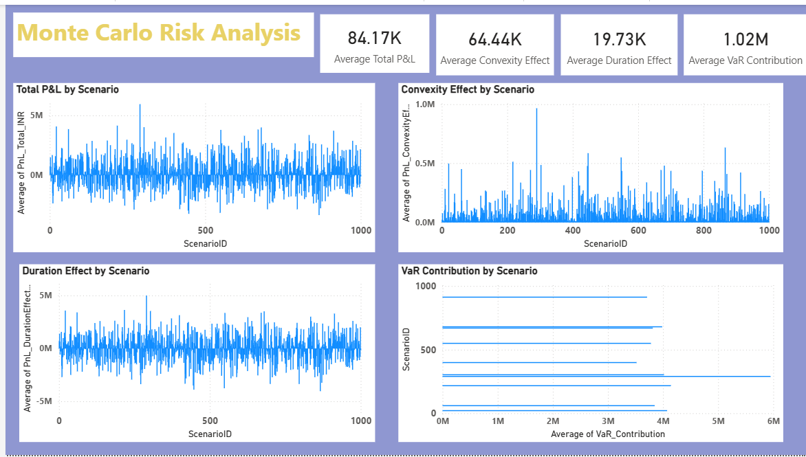

# 📊 Monte Carlo Risk Analysis – Power BI

---

## 📌 Project Overview

This project demonstrates **Monte Carlo simulation-based risk analysis** for a bond portfolio using **Microsoft Power BI**. The dashboard helps evaluate portfolio risk, interest rate sensitivity, duration, convexity, yield curve movements, and Value at Risk (VaR) through interactive visualizations.

The solution showcases an end-to-end Business Intelligence workflow including data preparation, financial analysis, DAX calculations, and dashboard development for investment risk monitoring.

---

# 📸 Dashboard Preview

## Executive Dashboard

Provides a high-level summary of the bond portfolio, including portfolio value, average yield, duration, convexity, issuer exposure, and key performance indicators.



---

## Yield Curve Analysis

Visualizes yield curve movements, zero-rate curves, forward rates, discount factors, and interest-rate sensitivity across different maturities.



---

## Monte Carlo Risk Analysis

Analyzes simulated portfolio outcomes using Monte Carlo scenarios to estimate portfolio risk, profit & loss distribution, Value at Risk (VaR), and investment uncertainty.



---

# 🎯 Business Objectives

- Evaluate bond portfolio performance
- Analyze interest rate risk
- Measure portfolio duration and convexity
- Simulate future market scenarios using Monte Carlo simulation
- Estimate portfolio Value at Risk (VaR)
- Support investment decision-making through interactive dashboards

---

# 📂 Dataset

The project uses financial datasets including:

- Bond Portfolio Data
- Historical Yield Curve Data
- Monte Carlo Simulation Scenarios

---

# 🛠 Tools & Technologies

- Microsoft Power BI
- Power Query
- DAX
- Data Modeling
- Monte Carlo Simulation
- Financial Risk Analytics
- Data Visualization

---

# 💡 Skills Demonstrated

- Financial Data Analysis
- Risk Analytics
- Monte Carlo Simulation
- Dashboard Development
- Data Modeling
- DAX Measures
- Power Query
- Portfolio Performance Analysis
- Yield Curve Analysis
- Interactive Reporting

---

# 📊 Dashboard Features

### Executive Dashboard

- Portfolio Overview
- Portfolio Value
- Average Yield
- Duration
- Convexity
- Issuer Exposure
- Sector Allocation

### Yield Curve Dashboard

- Yield Curve Visualization
- Zero Rate Curve
- Forward Rate Analysis
- Discount Factor Analysis
- Interest Rate Comparison

### Monte Carlo Dashboard

- Portfolio Simulation
- Profit & Loss Distribution
- Value at Risk (VaR)
- Risk Distribution
- Scenario Analysis

---

# 🔍 Key Insights

- Monte Carlo simulation helps estimate potential portfolio outcomes under uncertain market conditions.
- Yield curve analysis highlights the impact of interest rate changes on bond prices.
- Duration and convexity provide valuable measures of interest rate sensitivity.
- Interactive dashboards enable faster identification of portfolio risks and investment opportunities.

---

# 📈 Future Improvements

- Add Stress Testing Scenarios
- Implement Scenario Comparison
- Integrate Live Market Data
- Publish Dashboard to Power BI Service
- Enable Scheduled Data Refresh
- Add Portfolio Optimization Module

---

# 📁 Repository Structure

```text
📦 Monte-Carlo-Risk-Analysis-PowerBI
│
├── dashboard-screenshots
│   ├── executive-dashboard.png
│   ├── yield-curve-analysis.png
│   └── monte-carlo-risk-analysis.png
│
├── dataset
│   ├── bond_portfolio_data.csv
│   ├── monte_carlo_scenarios.csv
│   └── yield_curve_history.csv
│
├── powerbi
│   └── Monte-Carlo-Risk-Analysis.pbix
│
└── README.md
```

---

# 👨‍💻 Author

**Ayush Sajgotra**

Aspiring Data Analyst | Power BI | SQL | Excel

- LinkedIn: https://linkedin.com/in/ayush1900
- GitHub: https://github.com/Ayush1-jpg
